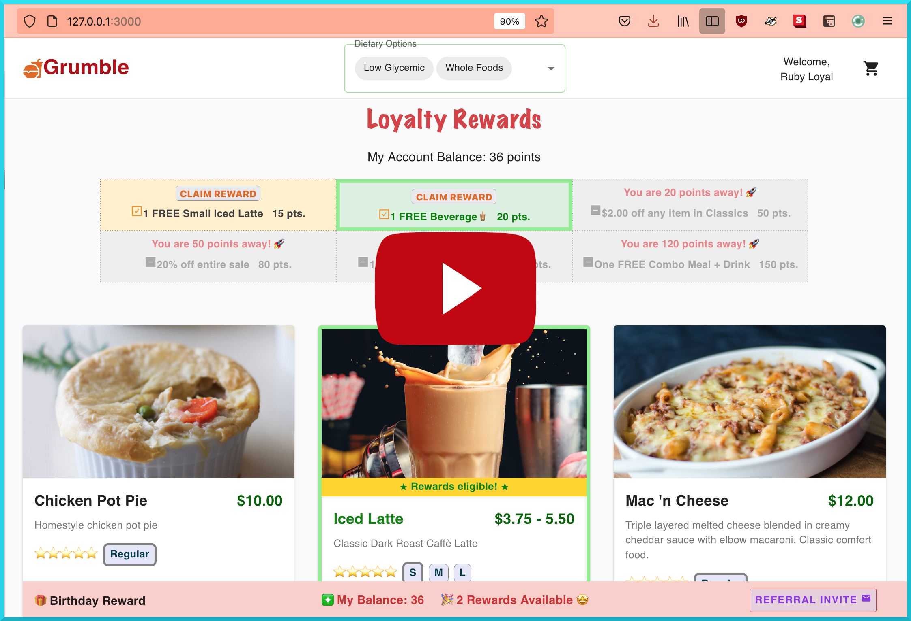

# Square Loyalty Rewards

 

## Table of Contents 
**[Installation](#installation)** &nbsp;| &nbsp; **[Configuring your environment](#configuring-your-environment)** &nbsp; | &nbsp; **[Inspiration](#inspiration)** &nbsp; | **[Video Demo](#video-demo)** &nbsp; | &nbsp;  **[Screen Shots](#screen-shots)** &nbsp; | &nbsp; **[Limitations](#limitations)** &nbsp; | &nbsp; **[Accomplishments](#accomplishments)**

 

## Installation 
1. Clone this repository
3. Run **`npm run install-all`** from the root directory to install all dependencies
4. Run **`cd server && npm start`** to run the node server on localhost:5000
5. Run **`cd client && npm start`** in a new Terminal tab to start the React app on localhost:3000

 

### Configuring your environment
Rename **`.env.example`** to **`.env`** and add your Square app credentials.

 

## Inspiration
I’ve used Square POS before as both an employee and customer. But it wasn't until this hackathon that I became aware of the company behind this software. I used to work as a barista at a bubble tea franchise. Ordering bubble tea<b>&#x1F9CB;</b> (or *boba* tea <b>&#x1F609;</b>) is an expensive, luxury treat. It's far cheaper (and healthier) to make bubble tea yourself. Given that the majority of customers who frequented the shop were college students, I believe we would have seen an increase in regulars & returning customers if the shop offered a customer loyalty reward program (students would ask about discounts or stamp cards from time to time). Offering incentives based on purchases made & points earned is a great way to build and retain a loyal customer base. 

A referral program is another great marketing strategy for promoting a business. Is there demand for a referral + affiliate program within Square's seller community? Indeed, there is! If you search the seller community forum for 'affiliate referral', you'll get back <a href="https://www.sellercommunity.com/t5/forums/searchpage/tab/message?q=affiliate%20referral" target="_blank"><strong>200+ results related to this query</strong></a>. Here's <a href="https://www.sellercommunity.com/t5/Questions-How-To/Will-Square-Loyalty-be-developing-customer-referral-affiliate/td-p/214470" target="_blank"><strong>a recent post by one Square seller</strong></a> requesting an affiliate refferal program in conjunction with Square's Loyalty program to be packaged as an all-in-one, seamless customer Square Loyalty experience.

 

## Video Demo

 

## Screen Shots
</a>
 
</a>
 
</a>
</a>
 
</a>
 
</a>
 
</a>
 

## Limitations
Unfinished, buggy app &nbsp; ★ &nbsp; Broken code <b>&#9785;&#65039;</b>  

 

## Accomplishments

✔︎ Looked at yummy food pics w/o craving anything <b>&#x1F632;</b>

✔︎ Learned react-redux reducers from <a href='https://youtube.com/watch?v=9jULHSe41ls'><strong>this well explained video tutorial</strong></a>.

✔︎ Tried following <a href="https://www.coreycleary.me/project-structure-for-an-express-rest-api-when-there-is-no-standard-way/"><strong>this guide</strong></a> on how to best structure project code in hopes that it would make my spaghetti code <b>&#x1F35D;</b> `</>` less unpleasant to read & manage. It's the best explanation that I found online (aka the only one I understood). Idk if I structured my code correctly, but I did notice an improvement in overall organization & workflow.

 

